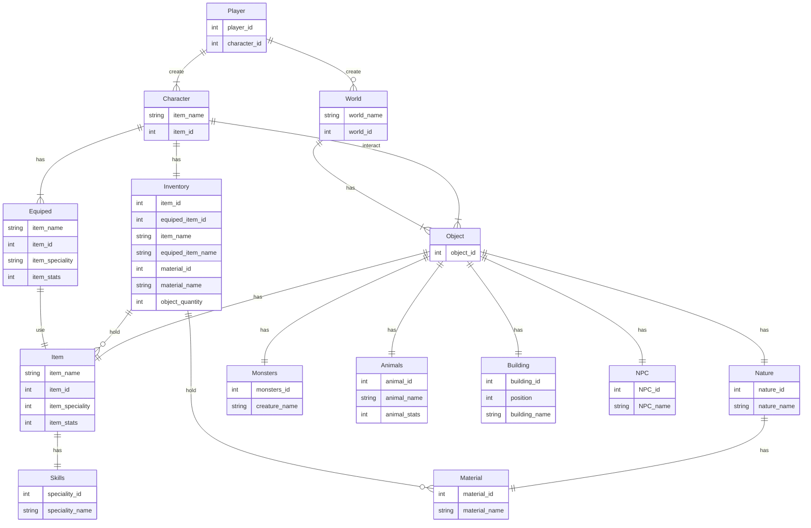
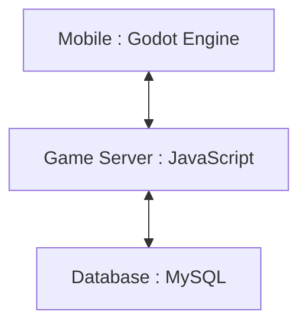

# Membuat game Survival dengan tampilan yang menghibur

## 1.1 Latar Belakang
Game ini merupakan game RPG (Role Playing Game). Sebelumnya apa yang disebut denga game RPG itu? Game RPG adalah game yang dimana pemain mengontrol satu karakter atau tokoh utama dalam sebuah game yang dimainkan, sebagai tokoh utama, pemain dapat menjelajah, berinteraksi, dan berperan penuh dalam game tersebut. Di sini saya memang suka dengan game yang bertemakan RPG atau survival karena saya suka dengan game yang bertemakan bertahan hidup, karena game seperti itu menurut saya tidak gampang membosankan karna ada banyak hal yang dapat di lakukan dari game bertemakan tersebut. Contoh nya seperti Undawn, Lifeafter, dan masih banyak lagi, game-game yang saya sebutkan tadi adalah game yang bertemakan RPG atau survival. Di game tersebut contoh nya kita dapat bertahan hidup dari berbagai serangan monster dan juga dapat mencari bahan-bahan untuk bertahan hidup seperti makanan atau pun alat untuk menyerang dan bertahan. 

Maka dari itu pada kesempatan kali ini saya ingin membuat game yang bertemakan RPG atau survival sesuai dengan game yang saya suka,tetapi ada perbedaan di game yang saya ingin buat ini karena di game yang saya akan buat ini, game survival nya itu tidak menyeramkan seperti game-game yang saya sebutkan di atas, karena terdapat beberapa orang yang ingin mencoba atau memainkan game survival tetapi tidak berani karena tampilan dan di dalam game nya itu menyeramkan karena realistis dari segi grafik nya, nah di sini saya akan menyediakan game survival tetapi dengan grafik yang menghibur dan penuh warna dan juga dari segi monster nya tidak begitu menyeramkan, jadi agar yang ingin mencoba game survival tetapi tidak berani karena takut akan tampilan di dalam in game yang menyeramkan teratasi dengan game yang saya buat ini.

Jadi di game ini kita dapat menjelajah map untuk berpetualang atau yang biasa kita sebut game openworld. Selain itu, Ketika kita sedang eksplore hutan akan ada rintangan seperti makhluk aneh yang akan menyerang kita, di game ini kita di siapkan alat senjata yaitu busur dan anak panah untuk menyerang ketika ada monster yang mendatangi kita untuk mencoba menyerang, sehingga kita harus bisa survive Ketika sedang eksplore di hutan. Selain itu juga di game ini kita dapat mengambil dan menyimpan buah-buahan seperti apel di inventory untuk bisa bertahan hidup.
## 1.2 Deskripsi Teknologi Informasi
Game Kibo The Explorer ini menggunakan game engine yaitu Godot V4. Desain Grafis dan Animasi yang digunakan dalam game ini yaitu menggunakan Assets seperti karakter,monster, latar belakang, animasi,        dan objek lainnya. Bahasa pemograman yang digunakan dalam game ini yaitu menggunakanan bahasa Godot itu sendiri yaiut GDscript. Game Kibo The Explorer game yang bertemakan game survival tetapi dengan tampilan yang menghibur, contoh nya dari segi warna dari karakter, latar tempat, yang penuh warna yang membuat pemain akan lebih terhibur dengan tampilan tersebut.
## 1.3 Branding
• Merk : Kibo The Explorer

• Tagline : Survival tetapi menyenangkan

• Campaign : Memperlihatkan game survival atau RPG tetapi dengan tampilan yang tidak menyeramkan tetapi menyenangkan, agar anak-anak bisa mencoba memainkan game bertemakan RPG sekaligus survival.

• Target user :
-	Usia 6+
-	Orang yang senang dengan game survival
-	Penggemar RPG
-	Seorang yang menyukai game survival tetapi takut dengan tampilan game yang menyeramkan
-	Orang yang gemar game petualangan
-	Orang yang gemar dengan tampilan game yang menghibur

• User experience theme :
-   Tampilan yang menghibur
-	Menyenangkan
-	Mudah
-	Warna yang cerah-cerah atau saat siang hari

• Inspirasi Design

Ketika user menggerakan karakter akan berpindah map/ latar belakang seperti gambar di bawah ini.


## 2.User Story
Sebagai  |   saya ingin bisa      |        Sehinnga			                        |    Prioritas
---|---|---|---
Pemain   |  Menjelajah map yang ada      | Dapat melihat ada apa saja yang ada di dalam game | ⭐⭐⭐⭐⭐
Pemain   |   Membunuh Makhluk aneh yang berkeliaran   |  Dapat merasakan survival di dalam game   |  ⭐⭐⭐⭐⭐
Pemain   |   Mengambil buah buahan      |   Dapat mengambil apel di pohon secara langsung  |    ⭐⭐⭐⭐
Pemain   |  Dapat menggunakan busur  |  Dapat menyerang musuh | ⭐⭐⭐⭐
Pemain | Dapat menyelam ke danau | Dapat bisa mendapatkan sumber makanan dari sungai | ⭐⭐⭐
Pemain | Dapat melemparkan anak panah | musuh dapat di serang dengan anak panah |  ⭐⭐⭐⭐
Pemain | Dapat menyimpan bahan makanan | bahan makanan dapat di kumpulkan di inventory | ⭐⭐⭐⭐
Pemain | Dapat menyimpan anak panah | untuk berjaga-jaga bila anak panah habis terpakai | ⭐⭐⭐
Pemain | Dapat memburu hewan | untuk bahan makanan atau bahan keperluan untuk bertahan hidup | ⭐⭐⭐
Pemain | Dapat membuat tempat tinggal | agar terdapat tempat untuk berlindung | ⭐⭐⭐⭐
Pemain | Dapat berubah waktu dari siang menjadi malam | Agar dapat merasakan suasanan yang berbeda- beda yaitu ketika malam dan siang| ⭐⭐⭐


## 3.Struktur Data

  
  
## 4.Arsitektur Sistem

    


## 5. Teknologi, Library, dan Framework
```
extends CharacterBody2D

var speed = 100

var player_state

func _physics_process(delta):
	var direction = Input.get_vector("left", "right", "up", "down")
	
	if direction.x == 0 and direction.y == 0:
		player_state = "idle"
	elif direction.x != 0 or direction.y != 0:
		player_state = "walking"
	
	velocity = direction * speed
	move_and_slide()
	
	play_anim(direction)

func play_anim(dir):
	
	if player_state == "idle":
		$AnimatedSprite2D.play("idle")
	if player_state == "walking":
		if dir.y == -1:
			$AnimatedSprite2D.play("n-walk")
		if dir.x == 1:
			$AnimatedSprite2D.play("e-walk")
		if dir.y == 1:
			$AnimatedSprite2D.play("s-walk")
		if dir.x == -1:
			$AnimatedSprite2D.play("w-walk")
		
		if dir.x > 0.5 and dir.y < -0.5:
			$AnimatedSprite2D.play("ne-walk")
		if dir.x > 0.5 and dir.y > 0.5:
			$AnimatedSprite2D.play("se-walk")
		if dir.x < -0.5 and dir.y > 0.5:
			$AnimatedSprite2D.play("sw-walk")
		if dir.x < -0.5 and dir.y < -0.5:
			$AnimatedSprite2D.play("nw-walk")

func player():
	pass
```


## 6.Design User Experience dan User Interface


### Ketika user menggerakan karakter ke atas, map/latar belakang akan berpindah seperti gambar di bawah ini


### Ketika user menggerakan karakter ke bawah, map/latar belakang akan berpindah seperti gambar di bawah ini


## 7. Demonstrasi Pembuatan Game
https://youtu.be/ZsVw8EXnSrg?si=DxxWdzxHqPuDDUI8


 


