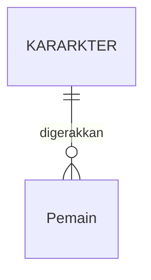

# Membuat game RPG dengan tampilan yang menghibur

## 1.1 Latar Belakang
Game ini merupakan game RPG (Role Playing Game). Sebelumnya apa yang disebut denga game RPG itu? Game RPG adalah game yang dimana pemain mengontrol satu karakter atau tokoh utama dalam sebuah game yang dimainkan, sebagai tokoh utama, pemain dapat menjelajah, berinteraksi, dan berperan penuh dalam game tersebut. Jadi di game ini kita dapat menjelajah map untuk berpetualang.Selain itu, Ketika kita sedang eksplore hutan akan ada rintangan seperti makhluk aneh yang akan menyerang kita, sehingga kita harus bisa survive Ketika sedang eksplore di hutan. Selain itu juga di game ini kita dapat mengambil buah-buahan seperti apel.  
## 1.2 Deskripsi Teknologi Informasi
Game Kibo The Explorer ini di buat menggunakan game Engine Godot v4 dan menggunakan GDscript yaitu bahasa di Godot sendiri
## 1.3 Branding
• Merk : Kibo The Explorer

• Tagline : Survival tetapi menyenangkan

• Campaign : Memperlihatkan game survival atau RPG tetapi dengan tampilan yang tidak menyeramkan tetapi menyenangkan, agar anak-anak bisa mencoba memainkan game bertemakan RPG sekaligus survival.

• Target user :
-	Usia 6+
-	Orang yang senang dengan game survival
-	Penggemar RPG
-	Seorang yang menyukai game survival tetapi takut dengan tampilan game yang menyeramkan
-	Orang yang gemar game petualangan
-	Orang yang gemar dengan tampilan game yang menghibur

• User experience theme :
-	Menghibur
-	Mudah
-	Warna yang cerah-cerah atau saat siang hari

## 2.User Story
Sebagai  |   saya ingin bisa      |        Sehinnga			                        |    Prioritas
---|---|---|---
Pemain   |  Menjelajah map yang ada      | Dapat melihat ada apa saja yang ada di dalam game | ⭐⭐⭐⭐⭐
Pemain   |   Membunuh Makhluk aneh yang berkeliaran   |  Dapat merasakan survival di dalam game   |  ⭐⭐⭐⭐⭐
Pemain   |   Mengambil buah buahan      |   Dapat mengambil apel di pohon secara langsung  |    ⭐⭐⭐⭐

## 3.Struktur Data

## 4.Arsitektur Sistem

flowchart LR
    A-->B-->C

## 5.Design User Experience dan User Interface

